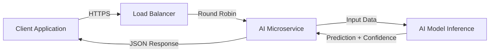

# Bank-Grade AI Microservice Template

A secure, production-ready FastAPI template designed for deploying AI models at Lloyds.

## Features

*   **FastAPI**: High performance, easy to learn, fast to code, ready for production.
*   **Pydantic**: Data validation and settings management using python type annotations.
*   **Docker**: Multi-stage builds, non-root user execution for enhanced security.
*   **CI/CD**: GitHub Actions workflow for automated testing and building.
*   **Bank-Grade Security**:
    *   Input validation with strict types.
    *   Minimal Docker image surface.
    *   Non-root user execution.

## System Architecture

The microservice is designed to fit into a scalable architecture:



1.  **Client Application**: Sends a POST request with applicant data.
2.  **Load Balancer**: Distributes traffic across multiple instances of the microservice.
3.  **AI Microservice (This Template)**:
    *   Validates input data against the `LoanApplication` schema.
    *   Passes clean data to the model.
    *   Formats the output into a standardized `PredictionResponse`.
4.  **AI Model Inference**: The core logic (currently simulated) containing the business rules or ML model.

## Setup

### Local Development

1.  **Clone the repository**:
    ```bash
    git clone <repository-url>
    cd <repository-directory>
    ```

2.  **Install dependencies**:
    ```bash
    pip install -r requirements.txt
    ```

3.  **Run the application**:
    ```bash
    uvicorn app.main:app --reload
    ```
    The API will be available at `http://localhost:8000`.
    Documentation: `http://localhost:8000/docs`

### Docker

1.  **Build the image**:
    ```bash
    docker build -t lloyds-ai-service .
    ```

2.  **Run the container**:
    ```bash
    docker run -p 8000:8000 lloyds-ai-service
    ```

## API Usage

**POST** `/api/v1/predict`

**Request Body**:
```json
{
  "applicant_income": 50000,
  "credit_score": 750,
  "loan_amount": 10000,
  "employment_status": "employed"
}
```

**Response**:
```json
{
  "approved": true,
  "confidence_score": 0.85
}
```
